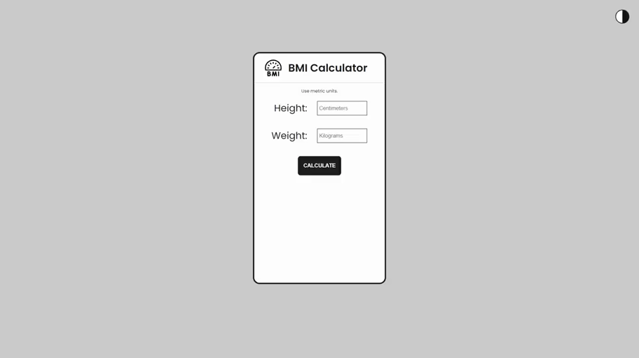

<h1>
BMI Calculator
</h1>

<h1>
    
</h1>

## 🧾 Sobre

Uma calculadora de IMC pode ajudar a identificar obesidade ou desnutrição em crianças, adolescentes, adultos e idosos. Este projeto foi realizado com o intuito de colocar em prática os estudos realizados e também para adquirir experiência com as tecnologias.

## 💻 Tecnologias utilizadas

- HTML
- CSS
- JavaScript

## 📚 Tutorial

A realização do projeto só foi possível com a ajuda do seguinte vídeo:

https://www.youtube.com/watch?v=RacwEvoTz_Y&ab_channel=FernandoLeonid
